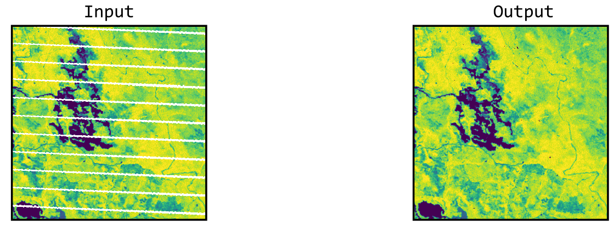
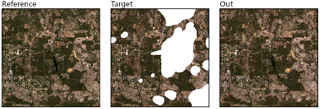

# noclouds

**noclouds** is a lightweight Python package for fast and scalable detection, removal, and filling of anomalous pixels in satellite imagery. It implements proven, peer-reviewed methods and leverages Xarray, Numba, and Dask for ease of use, speed, and scalability.

## Supported methods

### Gap-filling

<table>
  <thead>
    <tr>
      <th>Name</th>
      <th>Citation</th>
      <th>NumPy xr.DataArray</th>
      <th>Dask xr.DataArray</th>
      <th>Example</th>
    </tr>
  </thead>
  <tbody>
    <tr>
      <td align="left">MWR (Moving Window Regression)</td>
      <td align="left"><a href="https://www.mdpi.com/342052">Brooks et al. (2018)</a></td>
      <td align="center">✅</td>
      <td align="center">✅</td>
      <td align="center"></td>
    </tr>
    <tr>
      <td align="left">SSRF (Spatial-Spectral Random Forest)</td>
      <td align="left"><a href="https://doi.org/10.1016/j.srs.2022.100048">Wang et al. (2022)</a></td>
      <td align="center">✅</td>
      <td align="center">✅</td>
      <td align="center"></td>
    </tr>
  </tbody>
</table>

### Anomoly detection

<table>
  <thead>
    <tr>
      <th>Name</th>
      <th>Citation</th>
      <th>NumPy xr.DataArray</th>
      <th>Dask xr.DataArray</th>
      <th>Example</th>
    </tr>
  </thead>
  <tbody>
    <tr>
      <td align="left">MWMF (Moving Window Median Filter)&nbsp; &nbsp; &nbsp; &nbsp; &nbsp; </td>
      <td align="left"><a href="https://web.nateko.lu.se/personal/Lars.Eklundh/TIMESAT/prog/version33/TIMESAT33_SoftwareManual.pdf">Eklundh and Jönsson (2017)</a></td>
      <td align="center">✅</td>
      <td align="center">✅</td>
      <td align="center"></td>
    </tr>
  </tbody>
</table>

