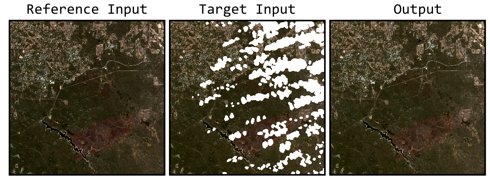

# noclouds

**noclouds** is a lightweight Python package for fast and scalable detection, removal, and filling of anomalous pixels in satellite imagery. It implements proven, peer-reviewed methods and leverages Xarray, Numba, and Dask for ease of use, speed, and scalability.

## Supported methods

### Gap-filling

<table style="width:100%;">
  <tr>
    <th>Method</th>
    <th>Citation</th>
    <th>Numba</th>
    <th>Dask</th>
    <th>Example</th>
  </tr>
  <tr>
    <td style="width:1%;">
SSRF (Spatial-Spectral Random Forest)
</td>
    <td>
Wang et al. (2022)
</td>
    <td>
✅
</td>
    <td>
✅
</td>
    <td></td>
  </tr>
  <tr>
    <td style="width:1%;">
MWR (Moving Window Regression)
</td>
    <td>
Brooks et al. (2018)
</td>
    <td>
✅
</td>
    <td>
✅
</td>
    <td></td>
  </tr>
</table>

### Anomoly detection

<table style="width:100%;">
  <tr>
    <th>Method</th>
    <th>Citation</th>
    <th>Numba</th>
    <th>Dask</th>
    <th>Example</th>
  </tr>
  <tr>
    <td style="width:1%;">
Median Filter Spike Removal
</td>
    <td>
Eklundh and Jönsson (2017)
</td>
    <td>
✅
</td>
    <td>
✅
</td>
    <td></td>
  </tr>
</table>

## Testing

<table>
  <thead>
    <tr>
      <th>Name</th>
      <th>Citation</th>
      <th>NumPy xr.DataArray</th>
      <th>Dask xr.DataArray</th>
      <th>Example</th>
    </tr>
  </thead>
  <tbody>
    <tr>
      <td align="left">MWR (Moving Window Regression)</td>
      <td align="left"><a href="https://www.mdpi.com/342052">Brooks et al. (2018)</a></td>
      <td align="center">✅</td>
      <td align="center">✅</td>
      <td align="center"></td>
    </tr>
    <tr>
      <td align="left">SSRF (Spatial-Spectral Random Forest)</td>
      <td align="left"><a href="https://doi.org/10.1016/j.srs.2022.100048">Wang et al. (2022)</a></td>
      <td align="center">✅</td>
      <td align="center">✅</td>
      <td align="center"></td>
    </tr>
  </tbody>
</table>

